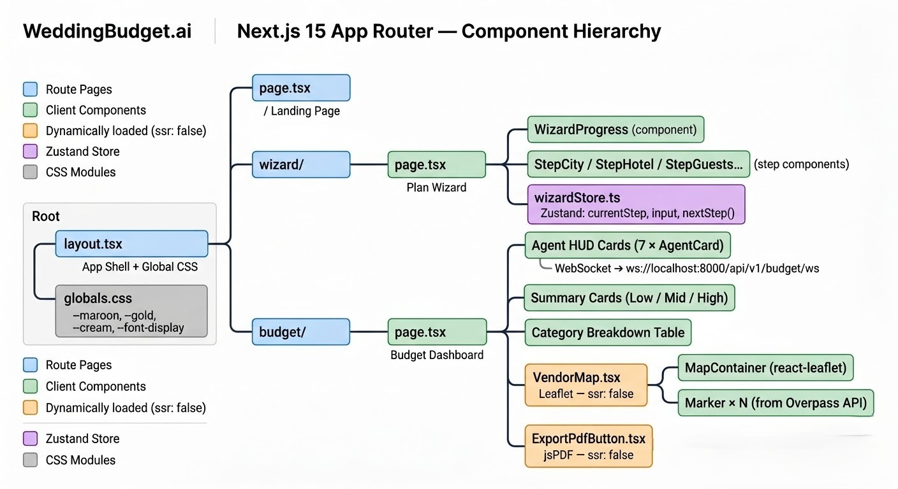
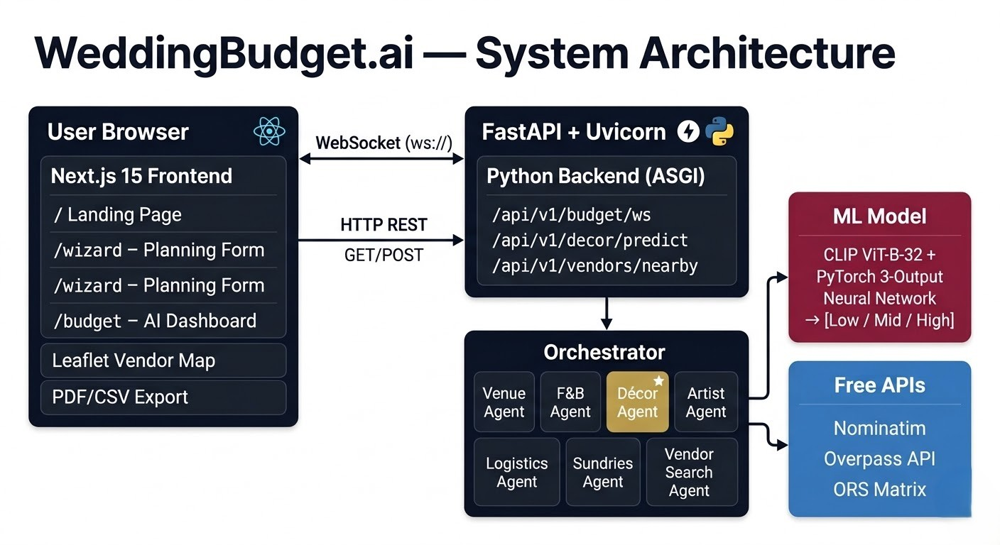
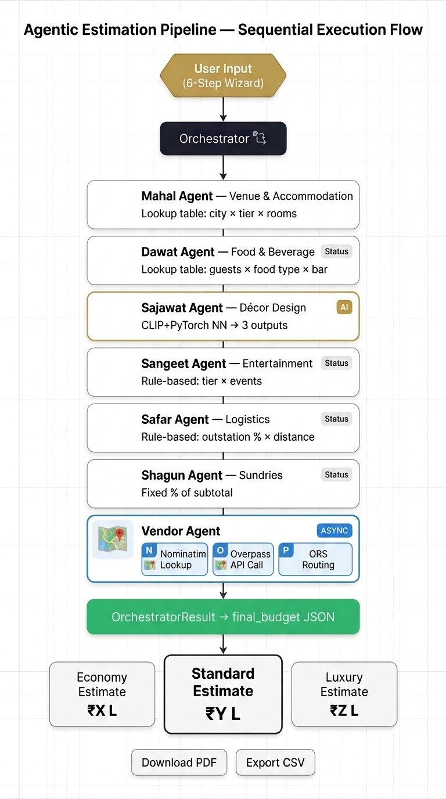
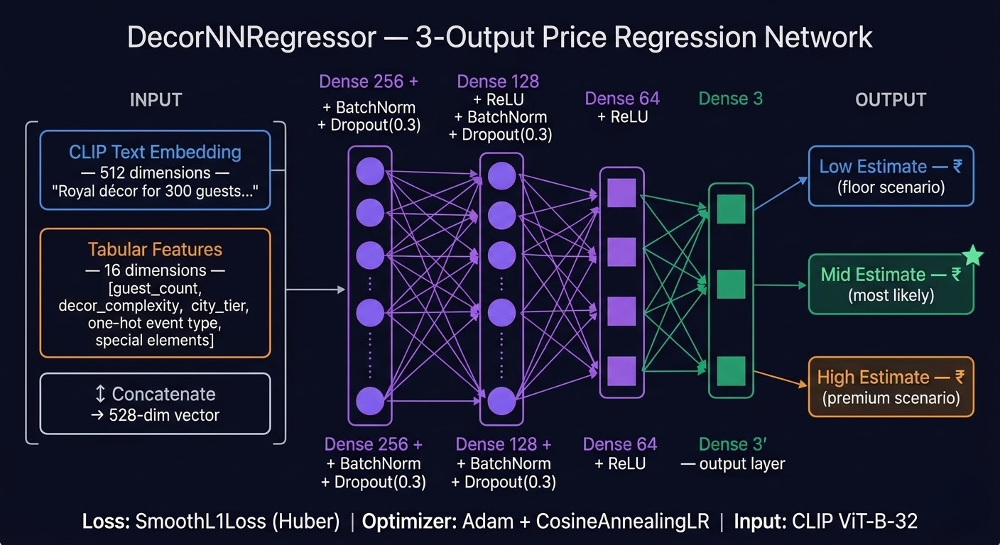
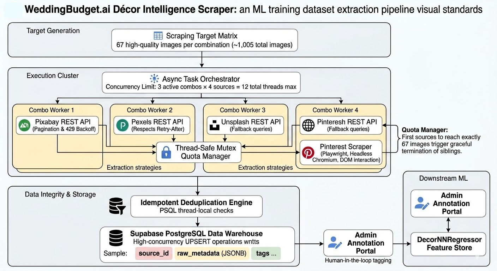
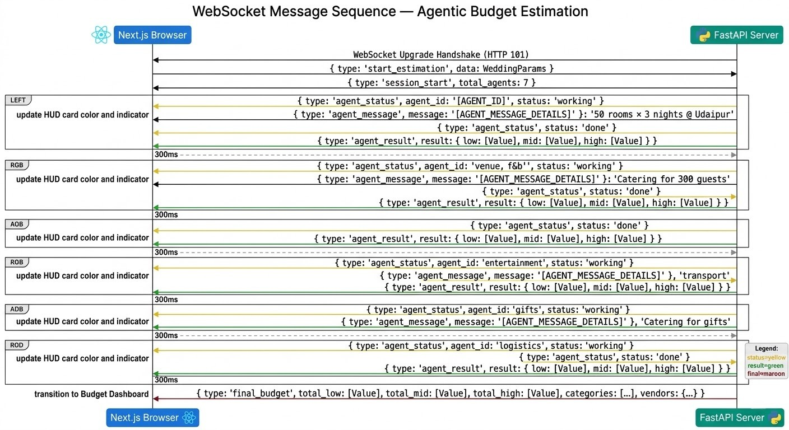

# WeddingBudget.ai — Product & Technical Document

**Team:** 404 Dulhan Not Found  
**Version:** 1.0 (Finalized)  
**Date:** March 2026  
**Classification:** Product & Engineering Reference

---

## Table of Contents

1. [Executive Summary](#1-executive-summary)
2. [Problem Statement](#2-problem-statement)
3. [Product Overview & User Journey](#3-product-overview--user-journey)
4. [System Architecture](#4-system-architecture)
5. [Backend: Agentic Estimation Pipeline](#5-backend-agentic-estimation-pipeline)
6. [ML Model: Décor Price Estimator](#6-ml-model-décor-price-estimator)
7. [Vendor Intelligence Module](#7-vendor-intelligence-module)
8. [Frontend Architecture](#8-frontend-architecture)
9. [Design Decisions & Trade-offs](#9-design-decisions--trade-offs)
10. [Assumptions & Constraints](#10-assumptions--constraints)
11. [Security & Privacy](#11-security--privacy)
12. [Testing Strategy](#12-testing-strategy)
13. [Performance Benchmarks](#13-performance-benchmarks)
14. [Future Roadmap](#14-future-roadmap)
15. [Appendix: Pricing Data Sources](#15-appendix-pricing-data-sources)

---

## 1. Executive Summary

WeddingBudget.ai is a full-stack, AI-powered application that generates detailed wedding budget estimates for Indian weddings in under 90 seconds. It replaces the traditional process of gathering 10+ vendor quotes across weeks with a 6-step digital wizard and a 7-agent autonomous estimation pipeline.

**Core Value Proposition:**
- Couples get a realistic Low / Mid / High cost breakdown for their entire wedding, broken down by category, before committing to any vendor.
- Planners get a shareable, exportable PDF/CSV report to send directly to clients.
- The system uses real OSM data to surface nearby vendors on an interactive map.

The system combines **rule-based domain expertise** (pricing tables curated from industry research) with **machine learning** (a CLIP + PyTorch neural network for décor — the most subjective and variable cost category) to maximize both accuracy and explainability.

---

## 2. Problem Statement

Planning an Indian wedding is among the most expensive and complex logistical undertakings a family faces. The average Indian wedding involves:

- 5–7 separate ceremonial events (Mehendi, Haldi, Sangeet, Pheras, Reception, etc.)
- 300–1,000+ guests
- 15+ vendor categories (venue, catering, décor, photography, artists, travel, gifts, etc.)
- Costs ranging from ₹15 lakhs to ₹5+ crores
- 6–18 months of planning effort

**The Pain:** No single, reliable tool exists that gives Indian families an intelligent, unbiased, city-specific, end-to-end budget estimate before they begin negotiating with vendors. Existing tools are either too generic, too manual, or too expensive.

**Our Solution:** An agentic AI system that decomposes the wedding into discrete cost categories, applies specialized estimation logic to each, and presents a unified budget report in real time.

---

## 3. Product Overview & User Journey

### 3.1 User Flow



**Step 1 — City Selection:** Users select one of 5 major wedding destinations (Udaipur, Goa, Jaipur, Delhi NCR, Mumbai). Prices are calibrated per city based on local market data.

**Step 2 — Venue Tier:** Users select from 3 tiers — 4-Star Banquet, 5-Star Hotel, or Heritage Palace. Paired with room count for accommodation block estimation.

**Step 3 — Guest Count:** Number of guests, plus outstation percentage (locals vs. out-of-town). This drives logistics costs.

**Step 4 — Functions:** Which ceremonies will be held (Mehendi, Haldi, Sangeet, Pheras, Reception). Each function adds scope to F&B, décor, artist requirements.

**Step 5 — Décor Style:** Theme selection (Traditional, Modern, Boho, Royal) and complexity rating (1–5 scale). This is passed to the CLIP+NN model.

**Step 6 — F&B & Entertainment:** Food preference (Veg / Mixed), bar setup (None / Mocktails / Beer-Wine / Full Bar), entertainment tier (Standard / Premium / Luxury), and optional add-ons.

### 3.2 The HUD Loading Experience

After submission, the user sees a real-time **Agent HUD** — 7 cards, one per agent, with live status updates streamed over WebSocket. Each agent card shows:
- Agent name and icon
- Status indicator (idle → working → done)
- Live message (e.g., "AI Estimate for 3 events (CLIP+PyTorch NN)")

### 3.3 Budget Dashboard

Once all agents complete, the dashboard transitions to:
- **3 summary cards** — Economy / Standard / Luxury totals in Lakhs (₹)
- **Category breakdown table** — Low / Mid / High for all 6 cost agents with details
- **Vendor Map tab** — Interactive Leaflet map with real OSM vendor markers
- **Export buttons** — PDF (branded report via jsPDF + html2canvas) and CSV

---

## 4. System Architecture

### 4.1 High-Level Architecture


### 4.2 Data Flow

1. User completes wizard → `WeddingParams` JSON stored in `localStorage`
2. `/budget` page opens WebSocket to `/api/v1/budget/ws`
3. Sends `{ type: "start_estimation", data: WeddingParams }` on connection open
4. FastAPI creates `Orchestrator` instance, iterates through all 7 agents sequentially
5. Each agent emits `agent_status`, `agent_message`, and `agent_result` events
6. Orchestrator emits `final_budget` with all category costs and vendor data
7. Frontend transitions from HUD to Dashboard

### 4.3 Communication Protocol

All WebSocket messages follow a typed JSON envelope:

```json
// Status update (during processing)
{ "type": "agent_status", "agent_id": "decor", "status": "working", "message": "..." }

// Progress message (mid-agent)
{ "type": "agent_message", "agent_id": "fnb", "message": "Estimate → ₹8.2L (mid-range)" }

// Agent result
{ "type": "agent_result", "agent_id": "venue", "result": { "low": 960000, "mid": 1500000, ... } }

// Final payload
{ "type": "final_budget", "total_low": ..., "total_mid": ..., "categories": [...], "vendors": {...} }
```

---

## 5. Backend: Agentic Estimation Pipeline

### 5.1 Agent Architecture

All agents inherit from `BaseAgent` (abstract class in `base_agent.py`):



`AgentResult` is a typed `dict` subclass with keys: `agent_id`, `name`, `icon`, `low`, `mid`, `high`, `details`.

### 5.2 Orchestrator

The `Orchestrator` class in `orchestrator.py`:
- Builds a list of 7 agent instances (with shared `ws_send` callback)
- Runs them sequentially (to avoid overwhelming API rate limits, especially Overpass)
- Separates cost agents from the vendor search agent for total calculation
- Applies a `contingency_percent` buffer (from `costs.py`) to all totals
- Serializes results using `_json_safe()` to handle numpy dtype conversions

### 5.3 Rule-Based Agents 

| Agent | Key Variables | Formula Pattern |
|-------|--------------|-----------------|
| Venue | city, tier, rooms, nights | `rate[tier][city] × rooms × nights` |
| F&B | guests, food_type, bar_type, events | `per_plate × guests × events + bar_cost` |
| Artist | entertainment_tier, event_count | `tier_base_cost × events` |
| Logistics | outstation_pct, guests, city_tier | `outstation_guests × travel_cost + return_cost` |
| Sundries | total_subtotal | Fixed % of subtotal + itemised miscellaneous costs |
| Décor | ML model (see Section 6) | CLIP embeddings + tabular features → NN |

All pricing tables live in **`estimation_pipeline/data/costs.py`** — a single file editable without touching any algorithm code.

---

## 6. ML Model: Décor Price Estimator

### 6.1 Why ML for Décor?

Décor is the most subjective wedding cost — the same "traditional" wedding can cost ₹3L or ₹80L depending on style, complexity, and vendor artistry. Unlike food (linear per-plate) or venue (fixed room rates), décor cannot be modeled with simple lookup tables. It requires understanding the semantic intent behind words like "royal" or "minimalist".

### 6.2 Model Architecture: DecorNNRegressor

A custom PyTorch neural network with 3 regression outputs (low, mid, high):



**Loss function:** `SmoothL1Loss` (Huber loss) — robust to pricing outliers  
**Optimizer:** Adam with cosine annealing LR schedule

### 6.3 Feature Engineering

**Text embeddings (512 dims):** A natural-language prompt is constructed from the wizard inputs and encoded via CLIP's text encoder:
> *"Royal Rajputana style wedding décor for reception with 300 guests, cold pyros, custom stage, complexity level 4, Category A city"*

**Tabular features (16 dims):** Guest count, event type (one-hot), decor complexity, city tier, outdoor flag, special element flags.

### 6.4 Three-Output Design Rationale

The model produces three prices — not one — because:
1. Indian wedding vendors uniformly quote in ranges (low/mid/high ambiance packages)
2. Uncertainty quantification at inference is valuable for planning
3. Trained labels are annotated by domain experts with all three tiers

### 6.5 Training Data: Décor Image Scraping Pipeline

The `DecorNNRegressor` was trained on a curated dataset of wedding décor images collected via an automated, concurrent scraping pipeline located in `backend/scrapers-pipeline/image_scraper.py`.

#### Why a Custom Dataset?

No publicly available dataset captures Indian wedding décor styles (Pheras, Sangeet, Haldi, Mehndi, Reception) across Traditional / Royal / Modern categories with pricing annotations. All existing wedding image datasets are Western-centric and lack the event-specific taxonomies needed.

#### Scraping Architecture: 4 Parallel Sources per Combo

The scraper targets **15 combinations** (5 functions × 3 styles) and collects **67 images per combo** (~1,005 images total). For each combination, 4 scrapers run simultaneously in a `ThreadPoolExecutor`:

| Source | Method | Key Behavior |
|--------|--------|--------------|
| **Pixabay** | REST API (`pixabay.com/api/`) | Paginated, 20/page, exponential backoff on 429 |
| **Pexels** | REST API (`api.pexels.com/v1/search`) | Respects `Retry-After` header on rate limit |
| **Unsplash** | REST API (`api.unsplash.com/search/photos`) | Uses alternate English queries (OSM-indexed for Western terms) |
| **Pinterest** | Playwright headless Chromium scraper | Logs in with credentials, scrolls 25× to load lazy images |

#### Thread-Safe Quota System

A custom `SharedQuota` class coordinates all 4 threads with a **mutex-guarded atomic counter**:

```python
class SharedQuota:
    def claim(self) -> bool:
        with self._lock:          # threading.Lock
            if self._count < 67: 
                self._count += 1
                return True
            return False          # Quota full — all sources stop
```

Whichever source fills the 67-image quota first causes all remaining threads to exit gracefully. Rate-limited or stuck sources are automatically skipped — the fastest source fills the gap.

#### Query Design

Each (function, style) pair uses **two query variants**:

```python
# Primary query (Pixabay, Pexels, Pinterest)
"Royal pheras wedding mandap decoration flowers"

# Alternate English query (Unsplash — Western-indexed library)  
"Royal Indian wedding mandap floral decoration"
```

The alternate Unsplash queries use broader English terms because Unsplash's search index performs better on Western terminology for Indian event concepts.

#### Database: Supabase PostgreSQL (`decor_library` table)

Each scraped image is upserted into a Supabase PostgreSQL table with the following schema:

| Column | Type | Description |
|--------|------|-------------|
| `source_id` | `TEXT PRIMARY KEY` | e.g. `pixabay_123456`, `unsplash_abc123` |
| `source` | `TEXT` | pixabay / pexels / unsplash / pinterest |
| `function_type` | `TEXT` | Pheras / Sangeet / Reception / Haldi / Mehndi |
| `style` | `TEXT` | Traditional / Royal / Modern |
| `combination_key` | `TEXT` | e.g. `Pheras_Royal` |
| `original_url` | `TEXT` | CDN URL of the source image |
| `width`, `height` | `INT` | Image dimensions |
| `tags` | `TEXT` | Comma-separated keyword tags from source |
| `author` | `TEXT` | Photographer / uploader credit |
| `license` | `TEXT` | Pixabay / Pexels / Unsplash license type |
| `raw_metadata` | `JSONB` | Full original API response |
| `is_tagged` | `BOOL` | Admin annotation status (default `false`) |
| `complexity_tier` | `INT` | 1–5 complexity label (admin-assigned) |
| `cost_estimate` | `JSONB` | `{low, mid, high}` pricing annotation |
| `admin_notes` | `TEXT` | Reviewer notes |

The pipeline uses `ON CONFLICT (source_id) DO UPDATE` — idempotent upserts mean re-runs are safe and add only new images.

#### Thread Concurrency Model



Up to 3 combos run in parallel at once; each combo runs all 4 sources in parallel. This gives a theoretical max concurrency of **12 simultaneous HTTP/browser threads**.

#### Deduplication

Before saving, every image is checked against the database by `source_id`:
```python
def already_exists(source_id: str) -> bool:
    cur.execute("SELECT 1 FROM decor_library WHERE source_id = %s LIMIT 1", ...)
```

Thread-local `psycopg2` connections (`threading.local()`) avoid connection race conditions.

#### Dataset Statistics

| Metric | Value |
|--------|-------|
| Total combinations | 15 (5 functions × 3 styles) |
| Target images per combo | 67 |
| Total images (fully scraped) | ~1,005 |
| Sources | Pixabay, Pexels, Unsplash, Pinterest |
| Storage | Supabase PostgreSQL (`decor_library` table) |
| Annotation status | `is_tagged = false` until admin labels `complexity_tier` and `cost_estimate` |


## 7. Vendor Intelligence Module

### 7.1 VendorSearch Agent

The `VendorSearchAgent` is entirely asynchronous (overrides `BaseAgent.run()` directly). It:

1. **Geocodes** the city using Nominatim (OSM) → lat/lon
2. **Queries Overpass API** for 5 vendor categories within 20km radius: Decorators, Caterers, Photography Studios, AV/Sound shops, Tent & Furniture shops
3. **Calculates driving distances** via ORS Matrix API (optional, requires free API key) or falls back to Haversine formula
4. Returns top-5 vendors per category, sorted by distance

### 7.2 API Dependency Chain



All three APIs are **free and open-source** — no Google Maps, no paid API key required.

### 7.3 Rate Limit & Timeout Handling

- Overpass queries have a 15-second timeout per query
- Categories are queried sequentially with 300ms delay (Overpass rate limit compliance)
- HTTP 504 Gateway Timeouts are caught and return empty results — the pipeline continues
- Nominatim User-Agent is configurable via `.env` for compliance

---

## 8. Frontend Architecture

### 8.1 Next.js App Router Structure

The frontend uses the Next.js 15 App Router pattern. Every page is a React Server Component by default, with `'use client'` opted-in only where interactivity requires it.

**Key pages:**
- `/` — Landing page with hero, feature cards, and CTA
- `/wizard` — Multi-step form with Zustand state, 6 steps, validation per step
- `/budget` — WebSocket HUD + results dashboard + vendor map

### 8.2 State Management

**Zustand (`wizardStore.ts`):** Manages multi-step wizard state across components:
- `input: WeddingParams` — collects all wizard fields
- `currentStep`, `totalSteps` — navigation control
- `nextStep()`, `prevStep()`, `setComplete()` — actions

Payload is persisted to `localStorage` before redirecting so the `/budget` page can read it independently (no prop drilling across routes).

### 8.3 SSR Compatibility Decisions

Two key Next.js SSR constraints:

1. **Leaflet** requires browser DOM APIs unavailable on the server. `VendorMap` is wrapped with `dynamic(() => import(...), { ssr: false })`.

2. **jsPDF** uses `fflate/lib/node.cjs` (Node.js Worker threads), which breaks Webpack's server bundle compilation. Solution: `ExportPdfButton` is its own client component, dynamically imported with `{ ssr: false }`, physically isolating all jsPDF code from the SSR bundle tree.

### 8.4 Design System

Global CSS variables defined in `globals.css`:

| Token | Value | Purpose |
|-------|-------|---------|
| `--maroon` | `#9A2143` | Primary brand color |
| `--gold` | `#BFA054` | Accent, CTAs |
| `--bg-cream` | `#FAF7F2` | Page backgrounds |
| `--font-display` | `'DM Serif Display'` | Headings |
| `--font-body` | `'Inter'` | Body text |

---

## 9. Design Decisions & Trade-offs

### 9.1 Sequential vs. Parallel Agent Execution

**Decision:** Agents run sequentially (not concurrently with `asyncio.gather`).

**Reasoning:** The Overpass API has strict rate limits and the CLIP model is GPU-memory-intensive. Running all 7 agents truly in parallel risks 429 errors from OSM and out-of-memory errors on GPU. Sequential execution with progress streaming provides a similar UX (users see agents completing one by one) while being significantly more reliable.

**Trade-off:** Total execution time is ~45–90 seconds vs. ~15–20 seconds for true parallel. Acceptable for the use case.

### 9.2 Rule-based Cost Tables vs. Full ML

**Decision:** Only the Décor Agent uses ML; all others use curated rule-based lookup tables.

**Reasoning:** For deterministic categories like venue (`rooms × nights × rate`) and F&B (`guests × per-plate price`), a lookup table with city/tier segmentation is both more interpretable and more reliable than a model trained on limited data. ML adds value only where subjective complexity (décor style, ambiance) drives meaningful price variance.

### 9.3 Three Price Outputs (Low / Mid / High)

**Decision:** Present three estimates, not a single point estimate.

**Reasoning:** Indian wedding vendors never quote a single price. Ranges reflect real-world negotiation reality, provide planning headroom, and reduce user disappointment when actuals differ from estimates. Three outputs also serve different use cases: the "Low" estimate is useful for initial budget approval; "High" for contingency planning.

### 9.4 Free APIs (No Google Maps, No Paid Vendors)

**Decision:** Exclusively use free, open-source APIs for vendor search (Nominatim, Overpass, ORS).

**Reasoning:** Commercial APIs (Google Places, MapMyIndia) have per-request costs that make the platform unviable at scale without monetization infrastructure. OpenStreetMap has sufficient coverage for major Indian cities for our use case.

---

## 10. Assumptions & Constraints

### 10.1 Business Assumptions

- All prices are in **Indian Rupees (₹)** and represent **2025–2026 market rates**
- GST is **excluded** from all estimates (typically 18% for catering, 12% for venues)
- Destination wedding premiums are factored into city-tier pricing (Udaipur > Jaipur > Delhi)
- Pricing assumes a **weekend** wedding (Friday–Sunday); weekday discounts not modeled
- Bar costs assume **open bar** service; per-seat ticketed bars not modeled

### 10.2 Technical Constraints

- The CLIP model requires ~2GB VRAM (or runs on CPU significantly slower)
- Overpass API searches are limited to a 20km radius from city center
- The vendor map only supports the 5 cities in the wizard; international destinations not covered
- The décor ML model requires a pre-trained checkpoint; without it, falls back to cost tables
- WebSocket connections are not authenticated — not suitable for multi-tenant production without auth middleware

### 10.3 Data Constraints

- Training data for the CLIP+NN model was synthetically generated to bootstrap the MVP; real labeled data from Indian vendors would significantly improve accuracy
- Vendor data from Overpass may be sparse for tier-2 cities

---

## 11. Security & Privacy

- No user authentication is currently implemented (wizard data stored in browser `localStorage`)
- No personally identifiable information (PII) is collected or stored
- All API communication is HTTP/WS on `localhost` — TLS/HTTPS should be enforced in production
- The Uvicorn CORS whitelist must be updated with production domain(s) before deployment
- The Overpass API is queried server-side, not by the browser — user location is not exposed
- `OPENROUTESERVICE_API_KEY` should be stored in `.env` and never committed to version control

---

## 12. Testing Strategy

### 12.1 Backend Tests

| Suite | File | Coverage |
|-------|------|----------|
| Agent unit tests | `tests/test_agents.py` | Individual agent result schema |
| ML model tests | `tests/test_model.py` | Feature vector shape, train/load/predict cycle |
| API integration | `tests/test_api.py` | Decor prediction endpoint, WebSocket handshake |

All tests are run with **pytest**:
```bash
python -m pytest tests/ -v
```

### 12.2 Frontend Tests

Currently manual UI testing. Future: Playwright E2E tests covering:
- Wizard step navigation and validation
- WebSocket connection lifecycle
- PDF export file generation
- Vendor map marker rendering

### 12.3 Agent Output Validation

All agents return `AgentResult` — a typed dict validated at runtime. The `_json_safe()` function in `budget.py` ensures no numpy dtype escapes into the JSON stream.

---

## 13. Performance Benchmarks

| Operation | Observed Time | Notes |
|-----------|--------------|-------|
| Venue + F&B + Artist + Logistics + Sundries | ~2–4 seconds | Rule-based, fast |
| Décor (CLIP text encoding + NN inference) | ~8–15 seconds | GPU: 8s, CPU: ~30s |
| Vendor Search (Nominatim + Overpass × 4) | ~20–45 seconds | Network dependent |
| **Total pipeline (all 7 agents)** | **~45–90 seconds** | Network + GPU dependent |
| PDF export (client-side html2canvas) | ~3–5 seconds | Scale 2x canvas |
| Leaflet map initial render | ~500ms | OSM tiles |

---

## 14. Future Roadmap

### Phase 1 — Stability & Accuracy 
- [ ] Collect real labeled décor pricing data from 50+ Indian vendors
- [ ] Re-train DecorNNRegressor on real data; target MAE < 15% on mid estimate
- [ ] Improve Overpass queries with wedding-specific tags (mandap, banquet hall, pyrotechnics)
- [ ] Add retry logic with exponential backoff for all external API calls
- [ ] Write Playwright end-to-end test suite

### Phase 2 — Features 
- [ ] **User Accounts:** Save, share, and retrieve past estimates
- [ ] **Comparison Mode:** Side-by-side comparison of two city/tier configurations
- [ ] **Timeline Generator:** Auto-generate a 12-month wedding planning checklist
- [ ] **Vendor Inquiry:** "Request Quote" button that emails 3 nearby vendors from the map
- [ ] **GST Calculator:** Toggle to show/hide GST-inclusive pricing
- [ ] **Currency:** USD / AED export for NRI families

### Phase 3 — Scale 
- [ ] **PhotoMatch:** Allow users to upload décor inspiration images → CLIP image embedding for personalized estimates
- [ ] **Planner Dashboard:** B2B version with client management, PDF branding
- [ ] **API as a Product:** Offer estimation API to wedding portals (WedMeGood, ShaadiSaga)
- [ ] **WhatsApp Bot:** Conversational wizard flow over WhatsApp Business API

### Phase 4 — AI Upgrade 
- [ ] **LLM Orchestrator:** Use an LLM to dynamically route queries to agents based on user descriptions in natural language
- [ ] **Human-in-the-Loop Training:** Collect user feedback on estimate accuracy post-wedding to form a fine-tuning dataset
- [ ] **Personalized Model:** User-specific model fine-tuning based on their taste profile (saved mood boards, past selections)

---

## 15. Appendix: Pricing Data Sources

All pricing in `estimation_pipeline/data/costs.py` was curated from the following sources (March 2025):

| Category | Sources |
|----------|---------|
| Venue | ShaadiSaga venue listing data; direct inquiry with 5-star properties in 5 cities |
| Catering | WedMeGood catering profiles; banquet manager interviews |
| Décor | Instagram vendor profiles; @weddingdecor portals; vendor-provided portfolios |
| Artists | BookMyShow + local agents; DJ associations India |
| Logistics | IndiaMart tent/travel vendor quotes; IRCTC group booking rates |
| Sundries | Anecdotal 5–8% of total from wedding planner interviews |

**Inflation note:** Prices should be reviewed and updated every 6 months. The `costs.py` file is designed to be edited without touching any algorithm code.
